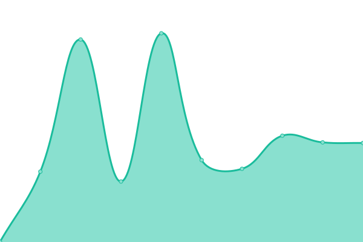
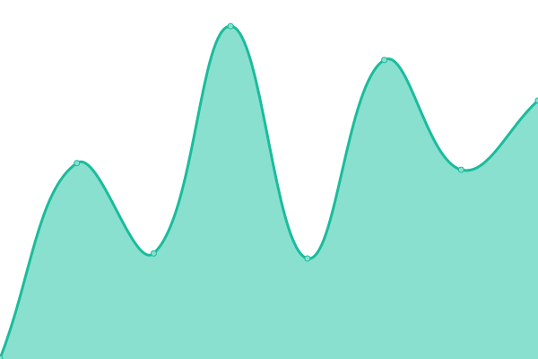
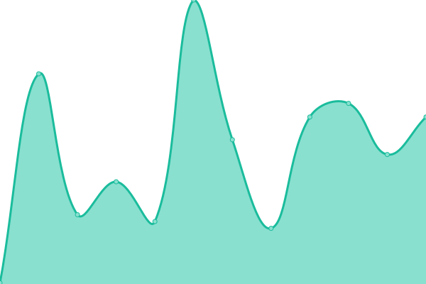

# [📈 Live Status](https://up.mirror.zinglix.xyz): <!--live status--> **🟧 Partial outage**

This repository contains the open-source uptime monitor and status page for [Liu Jun](https://zinglix.xyz), powered by [Upptime](https://github.com/upptime/upptime).

With [Upptime](https://upptime.js.org), you can get your own unlimited and free uptime monitor and status page, powered entirely by a GitHub repository. We use [Issues](https://github.com/ZingLix/blog-mirror-uptime/issues) as incident reports, [Actions](https://github.com/ZingLix/blog-mirror-uptime/actions) as uptime monitors, and [Pages](https://up.mirror.zinglix.xyz) for the status page.

<!--start: status pages-->
<!-- This summary is generated by Upptime (https://github.com/upptime/upptime) -->
<!-- Do not edit this manually, your changes will be overwritten -->
<!-- prettier-ignore -->
| URL | Status | History | Response Time | Uptime |
| --- | ------ | ------- | ------------- | ------ |
|  [zinglix.xyz](https://zinglix.xyz) | 🟩 Up | [zinglix-xyz.yml](https://github.com/ZingLix/blog-mirror-uptime/commits/HEAD/history/zinglix-xyz.yml) | 

 183ms
     
 | 

<a href="https://up.mirror.zinglix.xyz/history/zinglix-xyz">100.00%</a>
    

|  [blog.zinglix.xyz](https://blog.zinglix.xyz) | 🟥 Down | [blog-zinglix-xyz.yml](https://github.com/ZingLix/blog-mirror-uptime/commits/HEAD/history/blog-zinglix-xyz.yml) | 

 2253ms
     
 | 

<a href="https://up.mirror.zinglix.xyz/history/blog-zinglix-xyz">99.28%</a>
    

|  [cf.mirror.zinglix.xyz](https://cf.mirror.zinglix.xyz) | 🟩 Up | [cf-mirror-zinglix-xyz.yml](https://github.com/ZingLix/blog-mirror-uptime/commits/HEAD/history/cf-mirror-zinglix-xyz.yml) | 

 236ms
     
 | 

<a href="https://up.mirror.zinglix.xyz/history/cf-mirror-zinglix-xyz">100.00%</a>
    

|  [cf.ljnb.top](https://cf.ljnb.top) | 🟩 Up | [cf-ljnb-top.yml](https://github.com/ZingLix/blog-mirror-uptime/commits/HEAD/history/cf-ljnb-top.yml) | 

 332ms
     
 | 

<a href="https://up.mirror.zinglix.xyz/history/cf-ljnb-top">100.00%</a>
    

|  [zinglix.pages.dev](https://zinglix.pages.dev) | 🟩 Up | [zinglix-pages-dev.yml](https://github.com/ZingLix/blog-mirror-uptime/commits/HEAD/history/zinglix-pages-dev.yml) | 

 151ms
     
 | 

<a href="https://up.mirror.zinglix.xyz/history/zinglix-pages-dev">100.00%</a>
    

|  [nf.ljnb.top](https://nf.ljnb.top) | 🟩 Up | [nf-ljnb-top.yml](https://github.com/ZingLix/blog-mirror-uptime/commits/HEAD/history/nf-ljnb-top.yml) | 

 446ms
     
 | 

<a href="https://up.mirror.zinglix.xyz/history/nf-ljnb-top">100.00%</a>
    

|  [zinglix.netlify.app](https://zinglix.netlify.app) | 🟩 Up | [zinglix-netlify-app.yml](https://github.com/ZingLix/blog-mirror-uptime/commits/HEAD/history/zinglix-netlify-app.yml) | 

 156ms
     
 | 

<a href="https://up.mirror.zinglix.xyz/history/zinglix-netlify-app">100.00%</a>
    

|  [v.mirror.zinglix.xyz](https://v.mirror.zinglix.xyz) | 🟩 Up | [v-mirror-zinglix-xyz.yml](https://github.com/ZingLix/blog-mirror-uptime/commits/HEAD/history/v-mirror-zinglix-xyz.yml) | 

 216ms
     
 | 

<a href="https://up.mirror.zinglix.xyz/history/v-mirror-zinglix-xyz">100.00%</a>
    

|  [v.ljnb.top](https://v.ljnb.top) | 🟩 Up | [v-ljnb-top.yml](https://github.com/ZingLix/blog-mirror-uptime/commits/HEAD/history/v-ljnb-top.yml) | 

 310ms
     
 | 

<a href="https://up.mirror.zinglix.xyz/history/v-ljnb-top">100.00%</a>
    

|  [zinglix.vercel.app](https://zinglix.vercel.app) | 🟩 Up | [zinglix-vercel-app.yml](https://github.com/ZingLix/blog-mirror-uptime/commits/HEAD/history/zinglix-vercel-app.yml) | 

 111ms
     
 | 

<a href="https://up.mirror.zinglix.xyz/history/zinglix-vercel-app">100.00%</a>
    

|  [gh.mirror.zinglix.xyz](https://gh.mirror.zinglix.xyz) | 🟩 Up | [gh-mirror-zinglix-xyz.yml](https://github.com/ZingLix/blog-mirror-uptime/commits/HEAD/history/gh-mirror-zinglix-xyz.yml) | 

 163ms
     
 | 

<a href="https://up.mirror.zinglix.xyz/history/gh-mirror-zinglix-xyz">100.00%</a>
    

<!--end: status pages-->

[**Visit our status website →**](https://up.mirror.zinglix.xyz)

## 📄 License

- Powered by: [Upptime](https://github.com/upptime/upptime)
- Code: [MIT](./LICENSE) © [Liu Jun](https://zinglix.xyz)
- Data in the `./history` directory: [Open Database License](https://opendatacommons.org/licenses/odbl/1-0/)
